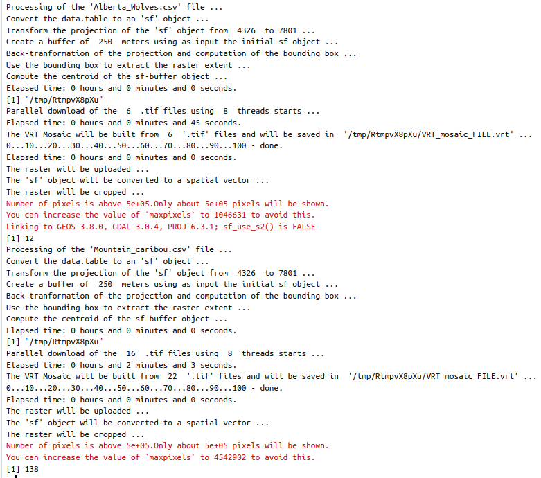
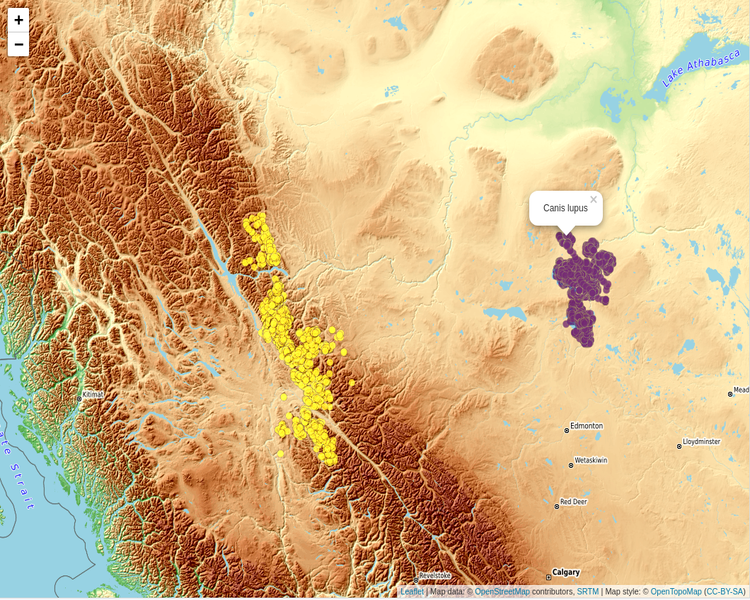
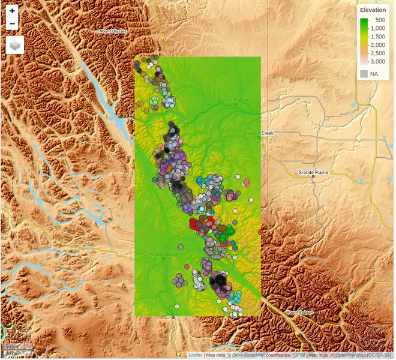
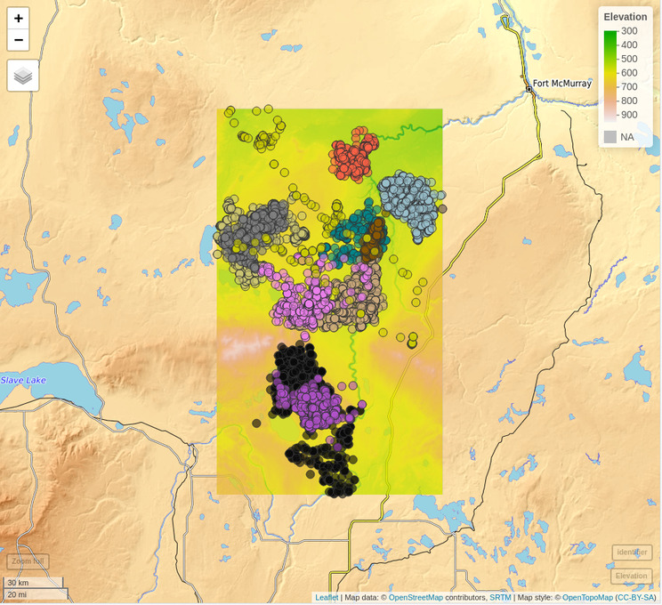

```{r, include = FALSE}
knitr::opts_chunk$set(fig.width = 6,
                      fig.height = 6, 
                      fig.align = "center",
                      warning = FALSE, 
                      message = FALSE,
                      echo = TRUE,
                      eval = FALSE)
```

<br>

In this vignette I'll explain how to use the [CopernicusDEM](https://CRAN.R-project.org/package=CopernicusDEM) R package based on a use case of the [Movebank animal tracking data](https://www.movebank.org/cms/movebank-main). I picked animal tracking data because there is an abundance in the *Movebank* archive from all over the world. In this specific vignette I'll use data of **Wolves** from the *northeastern Alberta* and **Caribou** from the *British Columbia* (see the reference papers at the end of the vignette for more information). 

<br>

The following wrapped code snippet creates the maps of this vignette, and it does the following:

* it loads the required files (**Alberta_Wolves.csv** and **Mountain_caribou.csv**)
* it iterates over the files
* inside the for-loop for each file (and animal) separately 
    * it keeps the required columns ('longitude', 'latitude', 'timestamp', 'individual_local_identifier', 'individual-taxon-canonical-name')
    * it builds a simple features object of the input data.tables
    * it creates a bounding box of the coordinate points
    * it extends the boundaries of the bounding box by 250 meters (so that points close to the boundaries are visible too)
    * it downloads and saves to a temporary directory the 30 meter elevation data for the Area of Interest (either for the 'Wolves' or the 'Tarandus')
    * it creates a Virtual Raster (.VRT) mosaic file of the multiple downloaded Elevation .tif files
    * it crops the Digital Elevation Model (DEM) using the previously created bounding box (the downloaded DEM's cover a bigger area, because they consist of fixed grid tiles)
    * it uses the **mapview** R package to visualize the results

<br>

```{r}

# We disable s2
sf::sf_use_s2(use_s2 = FALSE)

# We load the .csv files
files = c(system.file('vignette_data/Alberta_Wolves.csv', package = "CopernicusDEM"),
          system.file('vignette_data/Mountain_caribou.csv', package = "CopernicusDEM"))


taxon_data = mapv_data = list()


for (FILE in files) {
  
  cat(glue::glue("Processing of the '{basename(FILE)}' file ..."), '\n')
  
  dtbl = data.table::fread(FILE, header = TRUE, stringsAsFactors = FALSE)
  cols = c('location-long', 'location-lat', 'timestamp', 'individual-local-identifier', 
           'individual-taxon-canonical-name')
  
  dtbl_subs = dtbl[, ..cols]
  colnames(dtbl_subs) = c('longitude', 'latitude', 'timestamp', 'individual_local_identifier',
                          'individual-taxon-canonical-name')
  
  taxon_data[[unique(dtbl_subs$`individual-taxon-canonical-name`)]] = dtbl_subs
  
  dtbl_subs_sf = sf::st_as_sf(dtbl_subs, coords = c("longitude", "latitude"), crs = 4326)
  
  sf_rst_ext = fitbitViz::extend_AOI_buffer(dat_gps_tcx = dtbl_subs_sf,
                                            buffer_in_meters = 250,
                                            CRS = 4326,
                                            verbose = TRUE)
  
  #................................................................
  # Download the Copernicus DEM 30m elevation data because it has
  # a better resolution, it takes a bit longer to download because
  # the .tif file size is bigger
  #...............................................................
  
  dem_dir = tempdir()
  print(dem_dir)
  
  sfc_obj = sf_rst_ext$sfc_obj |>
    sf::st_make_valid()
  
  dem30 = CopernicusDEM::aoi_geom_save_tif_matches(sf_or_file = sfc_obj,
                                                   dir_save_tifs = dem_dir,
                                                   resolution = 30,
                                                   crs_value = 4326,
                                                   threads = parallel::detectCores(),
                                                   verbose = TRUE)
  
  TIF = list.files(dem_dir, pattern = '.tif', full.names = TRUE)
  
  if (length(TIF) > 1) {
    
    #....................................................
    # create a .VRT file if I have more than 1 .tif files
    #....................................................
    
    file_out = file.path(dem_dir, 'VRT_mosaic_FILE.vrt')
    
    vrt_dem30 = CopernicusDEM::create_VRT_from_dir(dir_tifs = dem_dir,
                                                   output_path_VRT = file_out,
                                                   verbose = TRUE)
  }
  
  if (length(TIF) == 1) {
    
    #..................................................
    # if I have a single .tif file keep the first index
    #..................................................
    
    file_out = TIF[1]
  }
  
  # Crop the DEM raster
  raysh_rst = fitbitViz::crop_DEM(tif_or_vrt_dem_file = file_out,
                                  sf_buffer_obj = sfc_obj,
                                  verbose = TRUE)
  
  # Downsample the raster to make the visualization feasible
  raysh_rst_downsample = terra::aggregate(x = raysh_rst, 
                                          fact = 5, 
                                          fun = mean,
                                          cores = parallel::detectCores())
  
  # create the Elevation OpenTopoMap
  mp_elev = mapview::mapview(x = raysh_rst_downsample,
                             col.regions = grDevices::terrain.colors(10),
                             layer.name = 'Elevation',
                             map.types = 'OpenTopoMap',
                             legend = TRUE)
  
  # get the unique colors of the identifier
  unq_color_ids = length(unique(dtbl_subs_sf$individual_local_identifier))
  print(unq_color_ids)
  set.seed(seed = 3)
  colors_ids = sample(x = colors(distinct = TRUE), 
                      size = unq_color_ids, 
                      replace = FALSE)
  
  # convert the identifier to a factor
  dtbl_subs_sf$individual_local_identifier = as.factor(dtbl_subs_sf$individual_local_identifier)
  
  # visualize the identifier
  mp_ids = mapview::mapview(dtbl_subs_sf, 
                            zcol = 'individual_local_identifier',
                            layer.name = 'identifier',
                            col.regions = grDevices::colorRampPalette(colors = colors_ids, space = "Lab"),
                            legend = ifelse(unq_color_ids > 10, FALSE, TRUE))
  
  # combine both mapview objects
  mp_both = mp_elev + mp_ids
  
  mapv_data[[unique(dtbl_subs$`individual-taxon-canonical-name`)]] = mp_both
}

```




<br>

Now, based on the saved data.tables we can create first the **map** (using the mapview R package) to view the data of both animals in the same map,

<br>

```{r}

#.............................................
# create the 'mapview' object of both datasets
#.............................................

dtbl_all = rbind(taxon_data$`Canis lupus`, taxon_data$`Rangifer tarandus`)

# see the number of observations for each animal
table(dtbl_all$`individual-taxon-canonical-name`)

# create an 'sf' object of both data.tables
dat_gps_tcx = sf::st_as_sf(dtbl_all, coords = c("longitude", "latitude"), crs = 4326)

lft = mapview::mapview(x = dat_gps_tcx,
                                zcol = 'individual-taxon-canonical-name',
                                map.types = 'OpenTopoMap',
                                layer.name = 'taxon-canonical-name',
                                legend = TRUE)
lft

```

<br>



<br>

The tracking data of the *Caribou* are on a higher elevation compared to the data of the *Wolves*. This is verified by the next map which includes the Elevation legend (**layer**). The additional legend shows the **individual identifier** of the animal - for the **Tarandus** there are **138** unique id's whereas

<br>

```{r}

mapv_data$`Rangifer tarandus`                           # caribou

```

<br>




<br>

```{r}

mapv_data$`Canis lupus`                                 # wolves

```

<br>

for the **Wolves** only **12**,

<br>



<br>

Elevation data using the **CopernicusDEM** R package can be visualized also in **3-dimensional space**. For the corresponding use case have a look to the [Vignette of the fitbitViz](https://CRAN.R-project.org/package=fitbitViz) package which uses internally the [Rayshader](https://github.com/tylermorganwall/rayshader) package.

<br>

**Movebank References**:

* [Latham Alberta Wolves](https://datarepository.movebank.org/handle/10255/move.949)
    * Latham ADM (2009) Wolf ecology and caribou-primary prey-wolf spatial relationships in low productivity peatland complexes in northeastern Alberta. Dissertation. ProQuest Dissertations Publishing, University of Alberta, Canada, NR55419, 197 p. url:https://www.proquest.com/docview/305051214
    * Latham ADM and Boutin S (2019) Data from: Wolf ecology and caribou-primary prey-wolf spatial relationships in low productivity peatland complexes in northeastern Alberta. Movebank Data Repository. \doi:10.5441/001/1.7vr1k987
* [Mountain caribou in British Columbia-radio-transmitter](https://datarepository.movebank.org/handle/10255/move.957)
    * BC Ministry of Environment (2014) Science update for the South Peace Northern Caribou (Rangifer tarandus caribou pop. 15) in British Columbia. Victoria, BC. 43 p. https://www2.gov.bc.ca/assets/gov/environment/plants-animals-and-ecosystems/wildlife-wildlife-habitat/caribou/science_update_final_from_web_jan_2014.pdf url:https://www2.gov.bc.ca/assets/gov/environment/plants-animals-and-ecosystems/wildlife-wildlife-habitat/caribou/science_update_final_from_web_jan_2014.pdf
    * Seip DR and Price E (2019) Data from: Science update for the South Peace Northern Caribou (Rangifer tarandus caribou pop. 15) in British Columbia. Movebank Data Repository. \doi:10.5441/001/1.p5bn656k
    
<br>
