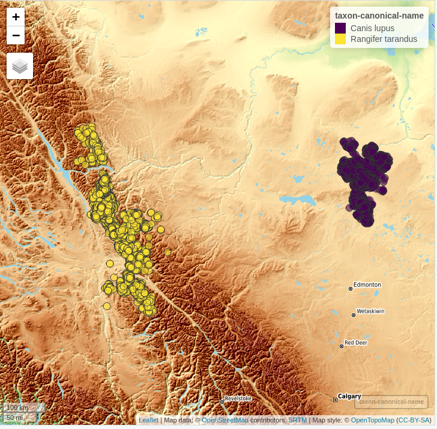

```{r, include = FALSE}
knitr::opts_chunk$set(fig.width = 6,
                      fig.height = 6, 
                      fig.align = "center",
                      warning = FALSE, 
                      message = FALSE,
                      echo = TRUE,
                      eval = FALSE)
```

<br>

In this vignette I'll explain how to use the [CopernicusDEM](https://CRAN.R-project.org/package=CopernicusDEM) R package based on a use case of the [Movebank animal tracking data](https://www.movebank.org/cms/movebank-main). I picked animal tracking data because there is an abundance in the *Movebank* archive from all over the world. In this specific vignette I'll use data of **Wolves** from the *northeastern Alberta* and **Caribou** from the *British Columbia* (see the reference papers at the end of the vignette for more information). 

<br>

The following wrapped code snippet creates the [leaflet](https://github.com/rstudio/leaflet) and [tmap](https://github.com/mtennekes/tmap) maps of this vignette, and it does the following:

* it loads the required files (**Alberta_Wolves.csv** and **Mountain_caribou.csv**)
* it iterates over the files
* inside the for-loop for each file (and animal) separately 
    * it keeps the required columns ('longitude', 'latitude', 'timestamp', 'individual_local_identifier', 'individual-taxon-canonical-name')
    * it builds a simple features object of the input data.tables
    * it creates a bounding box of the coordinate points
    * it extends the boundaries of the bounding box by 250 meters (so that points close to the boundaries are visible too)
    * it downloads and saves to a temporary directory the 30 meter elevation data for the Area of Interest (either for the 'Wolves' or the 'Tarandus')
    * it creates a Virtual Raster (.VRT) mosaic file of the multiple downloaded Elevation .tif files
    * it crops the Digital Elevation Model (DEM) using the previously created bounding box (the downloaded DEM's cover a bigger area, because they consist of fixed grid tiles)
    * it saves the **tmap** of each processed input file and the **data.table** which is required for the leaflet map to a separate list

<br>

```{r}

files = c(system.file('vignette_data/Alberta_Wolves.csv', package = "CopernicusDEM"),
          system.file('vignette_data/Mountain_caribou.csv', package = "CopernicusDEM"))


leafgl_data = tmap_data = list()


for (FILE in files) {

  cat(glue::glue("Processing of the '{basename(FILE)}' file ..."), '\n')

  dtbl = data.table::fread(FILE, header = TRUE, stringsAsFactors = FALSE)
  cols = c('location-long', 'location-lat', 'timestamp', 'individual-local-identifier', 
           'individual-taxon-canonical-name')

  dtbl_subs = dtbl[, ..cols]
  colnames(dtbl_subs) = c('longitude', 'latitude', 'timestamp', 'individual_local_identifier',
                          'individual-taxon-canonical-name')

  leafgl_data[[unique(dtbl_subs$`individual-taxon-canonical-name`)]] = dtbl_subs

  dtbl_subs_sf = sf::st_as_sf(dtbl_subs, coords = c("longitude", "latitude"), crs = 4326)

  sf_rst_ext = fitbitViz::extend_AOI_buffer(dat_gps_tcx = dtbl_subs_sf,
                                            buffer_in_meters = 250,
                                            CRS = 4326,
                                            verbose = TRUE)

  #................................................................
  # Download the Copernicus DEM 30m elevation data because it has
  # a better resolution, it takes a bit longer to download because
  # the .tif file size is bigger
  #...............................................................

  dem_dir = tempdir()

  dem30 = CopernicusDEM::aoi_geom_save_tif_matches(sf_or_file = sf_rst_ext$sfc_obj,
                                                   dir_save_tifs = dem_dir,
                                                   resolution = 30,
                                                   crs_value = 4326,
                                                   threads = parallel::detectCores(),
                                                   verbose = TRUE)

  TIF = list.files(dem_dir, pattern = '.tif', full.names = TRUE)

  if (length(TIF) > 1) {

    #....................................................
    # create a .VRT file if I have more than 1 .tif files
    #....................................................

    file_out = file.path(dem_dir, 'VRT_mosaic_FILE.vrt')

    vrt_dem30 = CopernicusDEM::create_VRT_from_dir(dir_tifs = dem_dir,
                                                   output_path_VRT = file_out,
                                                   verbose = TRUE)
  }

  if (length(TIF) == 1) {

    #..................................................
    # if I have a single .tif file keep the first index
    #..................................................

    file_out = TIF[1]
  }

  raysh_rst = fitbitViz::crop_DEM(tif_or_vrt_dem_file = file_out,
                                  sf_buffer_obj = sf_rst_ext$sfc_obj,
                                  CRS = 4326,
                                  digits = 6,
                                  verbose = TRUE)

  # convert to character to receive the correct labels in the 'tmap' object
  dtbl_subs_sf$individual_local_identifier = as.character(dtbl_subs_sf$individual_local_identifier)

  # open with interactive viewer
  tmap::tmap_mode("view")
  
  map_coords = tmap::tm_shape(shp = dtbl_subs_sf) + 
    tmap::tm_dots(col = 'individual_local_identifier')
  
  map_coords = map_coords + tmap::tm_shape(shp = raysh_rst, is.master = FALSE, name = 'Elevation') +
    tmap::tm_raster(alpha = 0.65, legend.reverse = TRUE)

  tmap_data[[unique(dtbl_subs$`individual-taxon-canonical-name`)]] = map_coords
}

```

```{r, echo = FALSE}

  #..........................................................................................
  # options to save the 'tmap' object:
  #
  #  1st. As an .html file which is approx. 9 MB
  #  2nd. As an .RDS object which saves the raster data too and it's approx. 98 MB
  #  3rd. Open in browser and take a screenshot and save the .png image
  #
  # Regarding the 1st. option an .html file can be loaded in an Rmarkdown file and
  # viewed on a web browser using 'iframe' in the following way:
  #
  # <iframe width='1000px' height='1000px' src='/home/lampros/Downloads/delete_vig.html' >
  # <p>Your browser does not support iframes</p>
  #  </iframe>
  #
  # see: https://stackoverflow.com/a/54637781/8302386
  #      https://stackoverflow.com/a/36525111/8302386
  #..........................................................................................

```


<br>

Now, based on the saved data.tables we can create first the **leaflet map** to view the data of both animals in the same map,

<br>

```{r}

#.....................................
# create the 'leafGl' of both datasets
#.....................................

dtbl_all = rbind(leafgl_data$`Canis lupus`, leafgl_data$`Rangifer tarandus`)

# see the number of observations for each animal
table(dtbl_all$`individual-taxon-canonical-name`)

# create an 'sf' object of both data.tables
dat_gps_tcx = sf::st_as_sf(dtbl_all, coords = c("longitude", "latitude"), crs = 4326)

lft = leaflet::leaflet()
lft = leaflet::addProviderTiles(map = lft, provider = leaflet::providers$OpenTopoMap)

lft = leafgl::addGlPoints(map = lft,
                          data = dat_gps_tcx,
                          opacity = 1.0,
                          fillColor = 'individual-taxon-canonical-name',
                          popup = 'individual-taxon-canonical-name')
lft

```

<br>



<br>

The tracking data of the *Caribou* are on a higher elevation compared to the data of the *Wolves*. This is verified by the next *tmap* which includes the Elevation legend (**layer**). The additional legend shows the **individual identifier** of the animal - for the **Tarandus** there are **138** unique id's whereas

<br>

```{r}

tmap_data$`Rangifer tarandus`                            # caribou

```

<br>


<br>

```{r}

tmap_data$`Canis lupus`                                  # wolves

```

<br>

for the **Wolves** only **12**,

<br>


<br>

Elevation data using the **CopernicusDEM** R package can be visualized also in **3-dimensional space**. For the corresponding use case have a look to the [Vignette of the fitbitViz](https://CRAN.R-project.org/package=fitbitViz) package which uses internally the [Rayshader](https://github.com/tylermorganwall/rayshader) package.

<br>

**Movebank References**:

* [Latham Alberta Wolves](https://www.datarepository.movebank.org/handle/10255/move.949)
    * Latham ADM (2009) Wolf ecology and caribou-primary prey-wolf spatial relationships in low productivity peatland complexes in northeastern Alberta. Dissertation. ProQuest Dissertations Publishing, University of Alberta, Canada, NR55419, 197 p. url:https://www.proquest.com/docview/305051214
    * Latham ADM and Boutin S (2019) Data from: Wolf ecology and caribou-primary prey-wolf spatial relationships in low productivity peatland complexes in northeastern Alberta. Movebank Data Repository. \doi:10.5441/001/1.7vr1k987
* [Mountain caribou in British Columbia-radio-transmitter](https://www.datarepository.movebank.org/handle/10255/move.957)
    * BC Ministry of Environment (2014) Science update for the South Peace Northern Caribou (Rangifer tarandus caribou pop. 15) in British Columbia. Victoria, BC. 43 p. https://www2.gov.bc.ca/assets/gov/environment/plants-animals-and-ecosystems/wildlife-wildlife-habitat/caribou/science_update_final_from_web_jan_2014.pdf url:https://www2.gov.bc.ca/assets/gov/environment/plants-animals-and-ecosystems/wildlife-wildlife-habitat/caribou/science_update_final_from_web_jan_2014.pdf
    * Seip DR and Price E (2019) Data from: Science update for the South Peace Northern Caribou (Rangifer tarandus caribou pop. 15) in British Columbia. Movebank Data Repository. \doi:10.5441/001/1.p5bn656k
    
<br>
